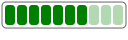

# Welcome to Victor

**Victor** is a lightweight, zero-dependencies Ruby library that lets you build
SVG images using Ruby code.

## Example

Building a Meter Bar with Victor.

+++ SVG Image

+++ Ruby Input
:::code source="assets/svg/meter.rb" :::
+++ SVG Code
:::code source="assets/svg/meter.svg" :::
+++

## How it works

Victor doesn’t interpret SVG; it simply transforms any unrecognized method call
into an SVG element. This means that when you call methods like `rect`,
`circle`, or `line`, Victor generates the corresponding SVG tags. You’re
describing the SVG structure and attributes directly in Ruby syntax.

