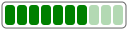

# Welcome to Victor

**Victor** is a lightweight, zero-dependencies Ruby library that lets you build
SVG images using Ruby code.

## Example

Building a Meter Bar with Victor.

+++ SVG Image

+++ Ruby Input
:::code source="assets/svg/meter.rb" :::
+++ SVG Code
:::code source="assets/svg/meter.svg" :::
+++

## How it works

Victor allows you to build SVG elements using plain Ruby. It translates any
method call it doesn’t recognize into an SVG tag, so calling methods like
`rect`, `circle`, or `line` automatically generates the corresponding SVG
tags.


### Key Features

1. **Initialization**: Create an SVG with attributes like `viewBox` or `style`:
    ```ruby
    svg = Victor::SVG.new viewBox: '0 0 100 100'
    ```
2. **Elements**: Add SVG elements with attributes by calling method with the tag name:
    ```ruby
    svg.rect x: 0, y: 10, width: 100
    ```
3. **Nesting**: Nest elements using blocks:
    ```ruby
    svg.g transform: 'translate(10 10)' do
      svg.rect x: 10, y: 10
    end
    ```
4. **Attributes and Styling**: Attributes are converted as you would expect:
    ```ruby
    svg.rect style: { fill: :blue, font_family: 'Roboto' }
    ```
5. **CSS**: Define styles using a hash:
    ```ruby
    svg.css['.box'] = { fill: :red }
    ```

